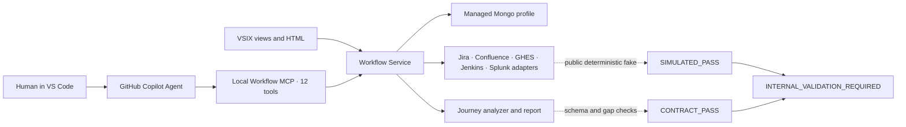

# Local Copilot SDLC Platform v2 Design

**Status:** Review baseline
**Date:** 2026-08-15
**Last updated:** 2026-08-16
**Audience:** Developer, Architect, QA, Scrum Master, Product Owner, Platform Engineering, Internal Implementation Agent
**Primary UI:** VS Code extension with human-readable HTML reports

## 1. Outcome

Build a human-controlled SDLC workbench around VS Code GitHub Copilot. All AI reasoning happens in the developer's local Copilot Chat. Server components provide deterministic workflow, context, storage, authorization, audit, and tool access, but never call a model.

The workflow supports Java/Spring APIs, business Web applications, iOS, Android, and cross-repository hybrid journeys. The account-opening journey uses an in-app WebView. Other journeys must explicitly declare their channel-transition model during onboarding.

## 2. Non-negotiable constraints

1. GitHub Copilot Chat in local VS Code is the only AI runtime.
2. Workflow Service, Jenkins, MongoDB, Splunk, Server MCP, and Local MCP do not call models and do not use MCP sampling.
3. VSIX does not call the VS Code Language Model API in the first release.
4. VSIX cannot wake or submit work to Copilot unattended. It can create deterministic workflow tasks, open the relevant UI, and copy the exact command; the user submits it.
5. Requirements, design, plans, skip attestations, PRs, and QA gates remain human controlled.
6. Jenkins continues to run the existing repository Groovy/Jenkinsfile CI. It is not an AI or code-intelligence server.
7. MVP runtime state and canonical structured artifacts are in the company's MongoDB. HTML is rendered on demand; Jira stores milestone summaries and, only when allowed, HTML/PDF attachments. GridFS/S3 are optional post-MVP providers, not dependencies. Durable approved configuration and documentation are in Git.
8. Source code stays in GitHub and the local workspace. MongoDB and Workflow Service do not store repository copies.
9. MVP authorization is `AUDIT_ONLY`: GitHub Enterprise authentication and employee binding remain mandatory, while role-based enforcement waits for corporate SSO/team-directory discovery.

## 3. Architecture

```text
Jira / Confluence / GitHub / Figma / AWS Toggle / Splunk
                         │
               deterministic integrations
                         │
        ┌────────────────┴────────────────┐
        │                                 │
Workflow Service + Server MCP       Developer workstation
state, policy, audit                 VS Code + Copilot Chat
MongoDB, Splunk                      VSIX + Local MCPs
        │                                 │
        └──────── Workflow REST/MCP ──────┘
                                          │
                               local code and device tools
```

Server MCP uses each user's delegated identity or token. It is preferable for shared enterprise context. Local MCP remains necessary for workspace code, Figma Desktop, browser automation, Xcode Simulator, and Android Emulator/ADB.

The MVP has no separate Scrum Board Web Service. Scrum Masters use a VSIX Scrum Master View backed by the same Workflow Service, and manually run a local `Delivery Coordinator Agent` when AI analysis is needed. Jira milestone comments provide visibility to people without VS Code.

Primary deliverables are:

- SDLC VSIX with My Work, Scrum Master, Epic, Ticket Detail, nested Repo Task Detail, Customization, MCP, Identity/Pod Configuration, and Diagnostics views;
- human-readable HTML report renderer;
- Workflow Service/API, Workflow MCP, company MongoDB configuration, on-demand HTML rendering, optional Jira attachment projection, and Splunk integration;
- central customization source repository and distributable bundle containing Agents, Skills, Instructions, Prompts, Hooks, MCP catalog/profiles, Schemas, Policies, Templates, Evals, Onboarding profiles, Pod routing rules, manifests, and version metadata;
- Epic Delivery Analyst, Delivery Coordinator, Requirement, Code Context, Solution Architect, Planner, stack Implementer, Test, Accessibility, Reviewer, and Documentation Agent definitions;
- Server MCP catalog and Local MCP Center;
- auditable GitHub Enterprise identity/employee binding and MVP Pod routing directory;
- fictional public adapters, internal handoff guide, and redacted completion-report template.

## 4. Repository and journey profiles

### 4.1 Repository profiles

- `java-spring-api`: controllers, WebFlux, clients, OpenAPI, DTOs, validation, error mapping, tests.
- `web-frontend`: routes, pages, components, state, design system, API clients, browser support, accessibility, tests.
- `ios-app`: Swift/SwiftUI/UIKit, targets, schemes, navigation, WebView, deep links, API clients, XCTest/XCUITest.
- `android-app`: Kotlin/Compose/Views, modules, variants, navigation, WebView, app links, API clients, unit/instrumentation/UI tests.

### 4.2 Account-opening journey profile

```yaml
journey: account-opening
hybrid:
  type: in_app_webview
release:
  web: continuous
  api: continuous
  native: release_train
nativeToggle:
  provider: aws
clientIdentification:
  platformHeader: required
  appVersionHeader: required
```

The exact AWS service, flag keys, header names, and version policy are internal configuration and must be confirmed by the internal agent.

### 4.3 Other journeys

Other journeys start with `hybrid.type: UNKNOWN`. Onboarding must ask whether they use native-only screens, Web, in-app WebView, system browser with Universal/App Link return, or a combination. Account-opening assumptions cannot leak into another journey.

## 5. Journey onboarding output

Journey onboarding produces more than a repository graph. Each step records:

- channel: Web, iOS, Android, WebView;
- repository, route/screen, Figma node and version;
- user action and entry condition;
- client symbol that constructs the request;
- HTTP method, normalized path, operation ID, API repository;
- request payload schema and field provenance;
- response fields used by the UI;
- loading, empty, error, permission, retry, and recovery states;
- authentication/session transfer;
- Feature Flag and minimum app version;
- next page/screen and cross-channel transition;
- source file, symbol, commit, confidence, and known gaps.

Payload onboarding stores schemas and redacted examples, never real customer payloads. Field provenance follows UI input -> state/view model -> request DTO -> serialized API field.

Cross-repository matching uses method + normalized path, OpenAPI operation ID, generated client types, DTO serialization fields, and service configuration. Dynamic URLs, reflection, custom encrypted payloads, or generated-at-runtime behavior are marked `AI_INFERRED` or `UNRESOLVED`.

### 5.1 Progressive onboarding gate

Epic creation does not require complete Repository/Journey onboarding. Readiness is one of `MISSING`, `PARTIAL`, `SUFFICIENT`, `VERIFIED`, or `STALE`:

- `MISSING` and `PARTIAL` may start Epic discovery and create targeted onboarding tasks;
- `SUFFICIENT` may enter formal design when every critical affected channel has verified evidence or an explicit `KNOWN_GAP` with risk acceptance;
- `VERIFIED` has current, commit-bound evidence for the relevant scope;
- `STALE` may guide discovery but requires targeted current-code verification.

Journey onboarding starts from a business scope plus at least one anchor: Jira, Confluence, Figma, a route/screen, an API, or a known repository. Users do not need to know the complete API/Web/iOS/Android repository set. The discovery result must classify every applicable channel as `REPOSITORY_VERIFIED`, `AUTHORITATIVE_DOC_ONLY`, `NOT_APPLICABLE`, `KNOWN_GAP`, or `UNRESOLVED`. Complete initial input is optional; complete disclosure of gaps is mandatory. Emergency work may continue through a time-bounded recorded exception.

## 6. Requirements discovery for weak Jira tickets

Jira is the requirements entry, not the complete specification.

```text
Jira + Figma
  -> Ticket Quality Assessment
  -> Journey/Repo Onboarding lookup
  -> freshness check
  -> targeted current-code and test analysis
  -> Current Behavior Evidence Pack
  -> AS_IS / TO_BE / UNKNOWN split
  -> Socratic requirement grilling
  -> Requirement Contract
  -> business approval + technical approval
```

### 6.1 Context precedence

- Journey onboarding is the cross-channel and cross-repository map.
- Repo/API onboarding is the navigation index and known architecture baseline.
- Current code and tests prove current implementation at a pinned commit.
- Jira and Figma describe proposed intent.
- BA/Product Owner decides new business behavior.
- Architect/Tech Lead validates technical interpretation and compatibility.

Onboarding never substitutes for current code. Every workflow checks `sourceCommit`, `lastVerifiedAt`, `evidenceFiles`, `confidence`, and `knownGaps`. `CURRENT` onboarding still triggers targeted verification of affected files. `STALE` onboarding creates a sync task before formal analysis.

### 6.2 Evidence classes

- `TEST_VERIFIED`
- `CODE_VERIFIED`
- `DOC_STATED`
- `HUMAN_CONFIRMED`
- `AI_INFERRED`
- `UNRESOLVED`

Critical `UNRESOLVED` items block design unless a time-bounded known-gap/emergency exception is recorded. `AI_INFERRED` cannot become a formal business rule without human confirmation.

### 6.3 Requirement Analyst behavior

The Requirement Analyst uses a company-owned `requirement-grilling` skill. It asks one highest-value question at a time, translates technical constraints into business language, and produces a Requirements Interview Report before a Requirement Contract.

Business decisions require BA/Product Owner approval. Technical interpretations require Architect/Tech Lead approval. One role cannot silently approve the other role's responsibility.

## 7. Human skip and prior-discussion attestation

Users may skip repeating a conversation with an Architect or Designer when the discussion already happened. They may not silently skip the required outcome, evidence, or risk gate.

### 7.1 Allowed skip types

- `ALREADY_REVIEWED_EXTERNAL`: meeting or offline review already completed.
- `NOT_APPLICABLE`: stage does not apply to the scoped change.
- `LOW_RISK_SELF_ATTESTED`: allowed only by risk policy.
- `EMERGENCY_EXCEPTION`: requires a named human approver/claimant and expiry; MVP records `UNVERIFIED_ROLE` rather than validating organizational authority.

### 7.2 Required attestation

- workflow, ticket, stage, actor, timestamp;
- reason and decision summary;
- Architect/Designer/BA identity or team;
- Jira comment, meeting note, approved Figma version, ADR, or other evidence reference;
- unresolved decisions and accepted risks;
- attester declaration;
- policy result and, when required, separate approver.

The state is `SKIPPED_WITH_EVIDENCE`, not `COMPLETED`. Low-risk work may allow self-attestation. Medium/high-risk compatibility, security, data, accessibility, cross-repository, or release changes still require a named approval record. In MVP `AUDIT_ONLY`, the claimed role is not verified and the workflow warns rather than blocks; later `ENFORCED` mode validates organizational authority. Workflow Service writes an immutable audit event in both modes.

### 7.3 Skipping the Design Agent

The platform distinguishes skipping the AI execution from skipping design responsibility:

- `DESIGN_AGENT_SKIPPED`: an existing human design or prior Architect decision is attached and satisfies the minimum Design Contract;
- `FAST_TRACK_TO_CODING`: a policy-classified low-risk test, documentation, internal refactor, or localized fix proceeds with a recorded implementation intent;
- `DESIGN_REQUIRED`: cross-repository, API contract, database, security/PII, Hybrid/Native interface, compatibility, Feature Flag, release-order, infrastructure, or other high-risk changes cannot self-skip.

Coding may start only when it has a minimum handoff covering scope, affected repositories, API/data changes, compatibility, risks, tests, release/flag behavior, rollback, decisions, and evidence. A skip records the requester, reason, policy result, evidence, and any required independent approver.

## 8. API/Web-first and Native-later compatibility

Web and API can deploy continuously or together. Native apps use a shared release train and may arrive later. API changes follow Expand -> Migrate -> Contract:

1. Add compatible API behavior and safe defaults.
2. Deploy API and Web without breaking old Native versions.
3. Ship Native code on the release train with AWS Toggle off.
4. Validate the released build.
5. Enable by platform, app version, user cohort, or journey.
6. Monitor completion rate, errors, fallback use, and old-version traffic.
7. Retire old behavior only after an approved support/adoption condition.

Breaking or potentially breaking changes include removed/renamed fields, new required fields, type/nullability/semantic changes, enum expansion for strict native clients, changed status/error/auth/pagination/idempotency behavior, and old valid payload rejection.

Every affected design and PR includes an API Compatibility Report, consumer/version matrix, contract tests, flag lifecycle, rollback, deprecation, and removal conditions. An OpenAPI diff is necessary but not sufficient because behavioral compatibility also matters.

Feature Flags require an owner, default, channel, minimum version, cohort, dependent API behavior, metric, kill switch, expiry, and removal condition. A missing or old client header always resolves to the safe legacy behavior.

## 9. Central customization repository

```text
sdlc-agent-platform/
├── plugin.json
├── agents/
├── skills/
├── instructions/
├── prompts/
├── hooks/
├── mcp/catalog.yaml
├── mcp/profiles/
├── schemas/
├── policies/
├── templates/
├── evals/
├── onboarding/
├── routing/
├── manifests/
├── docs/
└── versions/
```

The central repository holds reusable behavior, contracts, policies, templates, evaluation cases, and approved distribution metadata. It does not hold secrets, runtime tasks, source snapshots, full chats, or repository-specific architecture facts.

### 9.1 MVP distribution

Ordinary users do not clone the central repository. The VSIX Customization Center downloads an approved, versioned bundle from a GitHub Enterprise release, validates its manifest, schema, hash/signature, and compatibility, then activates Agent/Skill/Instruction/Hook locations and approved MCP definitions. For Copilot Agent Skills, it copies approved skill directories to the user's `~/.copilot/skills/<skill-name>/` location or registers the extracted bundle directory through VS Code `chat.agentSkillsLocations`; each directory name must match the `name` in `SKILL.md`. The user can verify discovery through Copilot Chat `/skills`. It supports Stable/Beta channels, explicit activation, diagnostics, the last-known-good version, and rollback. Tokens are stored in VS Code SecretStorage or the operating-system credential store, never in the bundle or `settings.json`.

Manual cloning is for platform maintainers who author changes and submit central-repository PRs. An internal Agent Plugin may replace the bundle mechanism later when enterprise policy and the VS Code preview capability are ready.

### 9.2 Placement rule

| Need | Place |
|---|---|
| Always guide code/design choices | Instructions |
| Repeatable task method, checklist, template, script | Skill |
| Persona, model preference, allowed tools, handoff | Agent |
| Deterministic local lifecycle action | Hook |
| Machine-valid output shape | Schema |
| Enforced authorization or stage decision | Policy |
| Regression test for customization behavior | Eval |

Code conventions belong in language/file-scoped instructions and deterministic linters/hooks. A coding skill explains a repeatable implementation workflow. The Implementer Agent selects the role, tools, and handoff; it should not duplicate standards.

Design principles belong in design instructions; the design procedure, checklist, ADR method, compatibility analysis, and templates belong in skills; the Architect Agent defines responsibility and tools; mandatory design sections and approvals belong in schemas and policies.

## 10. Agents and skills

Recommended agents:

- Epic Delivery Analyst: read-only Epic intake, Journey gaps, child-ticket matrix, dependency and release discovery.
- Delivery Coordinator: read-only Scrum Master analysis, stand-up, blockers, delivery risk, release readiness, and Jira-update drafts.
- Requirement Analyst: read-only; Jira, Figma, knowledge, journey, code evidence; uses requirement grilling.
- Code Context Analyst: read-only; produces a commit-bound Current Behavior Evidence Pack.
- Solution Architect: cross-repository design, compatibility, release sequence, rollback.
- Planner: produces repository DAG and executable implementation tasks.
- Web/iOS/Android/Java Implementers: edit only approved repositories and tasks.
- Test Designer: generates automated tests and manual E2E coverage.
- Accessibility QA: checks Web, iOS, and Android accessibility evidence.
- PR Reviewer: read-only, uses the approved reviewer model and review rubric.
- Documentation Curator: refreshes repo/journey/knowledge artifacts.

The central Skill catalog includes Epic intake/change request, Journey/Repo onboarding and gap analysis, requirement grilling, current-code evidence, API compatibility, ADR/design, cross-repository planning, Java/Web/iOS/Android implementation, automated-test generation, manual E2E, accessibility, PR preparation/review, release/Feature Flag, stand-up/blocker/release-readiness analysis, Pod roster import (`importing-pod-members`), and knowledge synchronization.

Skills are composed rather than copied into agents. Instructions hold always-on and language/design standards; Schemas define Requirement/Design/Test/Review/Coordination artifacts; Policies define stage and compatibility decisions; Evals protect format, behavior, safety, and regressions. The workflow validates the expected output artifact so correctness does not depend only on the model remembering to use a skill.

## 11. MCP deployment and catalog

### 11.1 Server MCP

- workflow tasks and results;
- Jira and Confluence;
- GitHub Enterprise metadata, PRs, and checks;
- Knowledge, Catalog, Domain, Journey, and approved onboarding;
- artifact metadata and authorized downloads;
- read-only Splunk diagnostics where policy permits.

Server MCP uses per-user delegated identity/token, authenticated resource access, audit, rate limits, and Splunk. Workflow-role enforcement is deferred in MVP `AUDIT_ONLY`. It never calls a model or uses sampling.

### 11.2 Local MCP

- local workspace/code intelligence when native VS Code tools are insufficient;
- Figma Desktop;
- browser/Playwright exploration;
- iOS Simulator/Xcode;
- Android Emulator/ADB;
- local diagnostic and Support Bundle collection.

### 11.3 VSIX MCP Center

The VSIX shows approved version, required/optional status, install source, permissions, health, logs, upgrade, disable, uninstall, and onboarding instructions. It registers MCP definitions but the MCP processes remain independently runnable. Installation always shows provenance and obtains user trust.

## 12. Workflow hierarchy, trigger model, and user journey

There are three top-level workflow definitions. Agent invocations, Repo Tasks, PR, CI, Review, QA, and Release are child stages or tasks, not additional top-level workflow types.

| Workflow | Scope | Owns | Does not duplicate |
|---|---|---|---|
| Epic Delivery Workflow | one Jira Epic or platform Delivery Group | shared outcome, Journey scope, Requirement Contract, cross-channel design, dependency DAG, compatibility/release strategy, aggregate health | child repository implementation |
| Ticket SDLC Workflow | one API/Web/Android/iOS Jira ticket | stack-specific scope, approvals, design delta, child Repo Tasks, ticket completion | shared Epic discovery already approved |
| Onboarding/Sync Workflow | Repository/Journey/Domain knowledge | baseline generation, freshness, dependency updates, approved documentation PR | feature delivery state |

The hierarchy is `Epic Delivery -> Ticket SDLC -> Repo Delivery Task`. A Repo Delivery Task is a child state machine inside a Ticket for one repository/PR; a one-repository Ticket creates one hidden default task. It never repeats Jira business analysis or cross-channel design. The Epic defines shared truth once; children reference a pinned version and add only stack/repository-specific detail.

### 12.1 What starts first

- For a multi-ticket Epic, start the Epic Delivery Workflow from VSIX Epic View or Scrum Master View. Import the API/Web/Android/iOS children, run scoped onboarding freshness checks, produce the shared Requirement Contract and dependency/release plan, then unlock child Ticket workflows.
- For a standalone ticket, start the Ticket SDLC Workflow directly. Workflow Service creates an implicit single-ticket Delivery Group so the data model remains consistent without burdening the user.
- If a user starts a ticket already attached to an active Epic workflow, VSIX offers **Join existing Epic workflow** and never creates duplicate requirements/design work.
- Missing or stale affected Repo/Journey onboarding does not block Epic discovery. It creates targeted Onboarding/Sync tasks and blocks only the affected high-risk design/coding gate when evidence remains insufficient and no recorded exception exists.
- If a Jira Epic spans unrelated Journeys, the platform may split it into multiple Delivery Groups while retaining the Jira Epic link.

Major urgent changes may be entered manually as an `Epic Change Request` without first editing Jira. The request versions the approved Requirement Contract instead of overwriting it, identifies affected child artifacts as `POSSIBLY_STALE`, and later projects a milestone comment/ticket update to Jira. Any authenticated MVP user may create or activate it; the audit record shows `UNVERIFIED_ROLE` and any same-actor approvals. A provisional Delivery Group may later bind to a formal Jira Epic.

The Workflow Service creates deterministic tasks. Only the user starts an AI step.

```text
VSIX: select Jira ticket -> Start workflow
Workflow API: create workflow and first task
VSIX: show exact agent + slash command
User: select Agent in Copilot Chat and submit command
Agent: claim context through MCP, work locally, submit structured result
VSIX: render HTML and request human approval
Workflow Service: unlock next task
```

Proposed commands:

- `/start-epic`
- `/start-ticket`
- `/analyze-code-context`
- `/grill-requirement`
- `/design-solution`
- `/plan-change`
- `/implement-task`
- `/generate-tests`
- `/prepare-pr`
- `/review-pr`
- `/sync-onboarding`

The VSIX may open Chat and copy a command, but the user performs the final submit. Approvals happen in VSIX/Workflow UI, not by a model assertion.

`/start-epic` runs under the read-only `Epic Delivery Analyst Agent`. It uses Epic intake, Journey gap analysis, requirement grilling, cross-ticket dependency mapping, API compatibility, and release-sequencing skills. It produces an Epic Intake Report, Scope/Gap Map, Candidate Journey Map, Child Ticket Matrix, Source Manifest, Open Questions, and recommended Onboarding/Requirement tasks. It does not write code, approve requirements, or replace the Solution Architect.

### 12.2 Jira comments as an external projection

Workflow Service is the system of record. Jira comments provide concise visibility to people who do not use the VSIX. The integration posts through an identified service account and explicitly shows the human actor; it never impersonates that person.

Create one current-status summary comment per workflow when the Jira API permits safe updates, plus append-only milestone comments for workflow start, Requirement approval, Design approval or audited skip, blocking decisions, PR ready, QA/release completion, and cancellation. Do not post Agent checkpoints, prompts, source excerpts, every generated test, or internal retries.

Each comment contains a stable idempotency marker, stage/result, human actor, timestamp, short decision or blocker, artifact/report link, and next action. Jira write failure records `JIRA_SYNC_PENDING` and retries; it cannot erase the authoritative Workflow event. Automatic Jira status transitions are deferred until each project mapping is validated and governed.

### 12.3 Detailed stage sequence

1. VSIX preflight validates Workflow API, verified identity, Copilot, approved customization bundle, required MCPs, repository profile, and local tools.
2. User selects an Epic or standalone Jira ticket. Multi-ticket delivery creates/joins an Epic parent; standalone work starts its Ticket workflow directly.
3. Requirement Analyst reads ticket, Figma, knowledge, onboarding, and freshness metadata.
4. Code Context Analyst or its fallback skill performs targeted current-code analysis.
5. Requirement Analyst performs Socratic clarification and submits Requirement Contract.
6. BA/Product Owner and Architect/Tech Lead approve their respective parts or provide an audited skip attestation.
7. Solution Architect produces design, compatibility report, flags, migration, release, and rollback.
8. Planner produces a cross-repository DAG and task contracts.
9. Implementers work repository by repository and generate tests.
10. Test Designer creates automation and manual E2E/accessibility matrices.
11. Feature PRs trigger existing Jenkins CI; Workflow Service reads GitHub check results.
12. Reviewer Agent produces advisory findings; human reviewers decide.
13. QA executes risk-selected manual E2E across WebView/native/API versions.
14. Merge/release follows the approved DAG and Web/API-first, Native-later model.
15. Webhooks create documentation/onboarding freshness tasks; a user later runs local Copilot to resolve them.

### 12.4 VSIX views and freshness contract

All server-backed views load through Workflow Service; they do not independently reconstruct workflow state from Jira/GitHub. Initial load fetches a versioned snapshot. Workflow events then refresh affected records through Server-Sent Events or WebSocket; MVP falls back to focus refresh, manual refresh, and 15-30 second polling when the event channel is unavailable. Every view shows `lastUpdatedAt`, source health, data version, and `LIVE`, `DELAYED`, `STALE`, or `OFFLINE`. Cached data is never presented as live.

| View | Primary source | Refresh behavior |
|---|---|---|
| Scrum Master View | Epic aggregates, team queues, dependencies, blockers, approvals, release/QA | Epic/Ticket/task/agent-result events |
| My Work | developer home: assignments, available Pod tasks, claims, next actions, approvals, recovery, PR/CI summaries | identity/team-filtered task events |
| Epic View | shared contracts, children, dependency DAG, AI coordination reports | Epic/artifact/Jira-sync events |
| Ticket Detail | one Jira ticket: stage, requirement/design delta, tests, release status, and child Repo Tasks | Ticket/Repo Task/PR/CI events |
| Repo Task Detail | nested under Ticket: one repository's branch, commit, PR, tests, CI, and review | GitHub/check/workflow events |
| Customization Center | approved central bundle manifest and installed version | on open, manual check, release notification |
| MCP Center | approved server catalog plus local process health | on open, process events, scheduled health check |
| Diagnostics | local logs/health plus Workflow/Splunk correlation IDs | live local events and explicit server diagnostics |

Scrum Master actions create AI tasks in Workflow Service; the button alone does not fabricate an AI result. After the user manually runs the `Delivery Coordinator Agent` in Copilot and it submits through Workflow MCP, Workflow Service stores a versioned result such as `EPIC_RISK_REPORT`, `STANDUP_REPORT`, `BLOCKER_ANALYSIS`, `RELEASE_READINESS_REPORT`, or `JIRA_UPDATE_DRAFT`, emits an event, and refreshes the view. Draft Jira updates still require explicit publication confirmation. Each AI panel shows task/result status and the source snapshot/version used, so an old analysis cannot appear current.

## 13. Accessibility QA

Accessibility is a separate QA gate. Findings and tests use tags such as `a11y:web`, `a11y:ios`, `a11y:android`, `a11y:keyboard`, `a11y:screen-reader`, `wcag:<criterion>`, `test:auto|manual`, and severity.

Test selectors (`data-testid`, iOS accessibility identifier, Compose test tag) do not replace user-facing accessible names, labels, roles, values, or semantics.

Web targets WCAG 2.2 AA. iOS covers VoiceOver, Dynamic Type, traits, hit regions, contrast, and system settings. Android covers TalkBack, font/display scaling, semantics/content descriptions, touch targets, and system navigation. Critical/blocker findings stop merge; major findings require correction or an approved, expiring exception.

## 14. Logs, identity, audit, telemetry, and traces

Logs, audit, telemetry, and evidence are different records:

- diagnostic logs explain failures;
- audit events prove who changed workflow state or authorization;
- metrics show reliability and duration;
- immutable artifacts preserve approved reports and QA evidence.

### 14.1 Correlation

Every component propagates W3C `traceparent` when possible and a platform correlation set:

```text
traceId, spanId, correlationId, workflowId, taskId,
ticketId, repositoryId, commitSha, pullRequestId,
component, componentVersion, eventName, durationMs,
result, errorCode, retryCount
```

Repository identifiers may be hashed in client telemetry when names are not required for support.

### 14.2 Identity and accountability

`principalId` is a random, immutable internal person key created by Workflow Service. It is not a VSIX installation ID and does not imply that the person has onboarded VSIX. A directory import may create the person and `principalId` before first login, then map mutable external identifiers such as employee ID, GitHub Enterprise login, email, and future SSO subject through `identityLinks`. On first VSIX login, Workflow Service links the authenticated account to the existing person record instead of creating a duplicate. Email and employee ID are not primary keys.

The MVP uses GitHub Enterprise login plus an administrator-approved employee-number binding for people who do log in. The VSIX Identity page lets a user sign in, view the linked record, refresh it, and report an error, but not freely edit trusted identifiers. People who have not installed/onboarded VSIX may still exist in the directory and receive a pending assignment; they simply cannot execute a local Copilot task until they log in.

MVP authorization is `AUDIT_ONLY`. Every authenticated person may create, join, activate, approve, or skip, but the system records the claimed role as `UNVERIFIED_ROLE`, warns on high-risk or same-actor approval, and never suppresses the audit trail. Later SSO/Teambook integration changes the policy mode to `ENFORCED` without changing workflow records.

### 14.3 Pod directory and task routing

The central repository may contain non-personal, reviewable routing configuration: stable `podId`, Journey/Domain ownership, repository patterns, Jira component/label rules, required capabilities, and role-slot names. It must not contain employee numbers, names, email addresses, or membership lists because Git history is persistent and membership changes frequently.

MongoDB stores directory people, `identityLinks`, and `teamMemberships` mapping `principalId` to `podId`, capability, and role. MVP membership is imported through the central `importing-pod-members` Skill and Workflow MCP. The Agent must perform server `DRY_RUN`, show a masked preview, obtain explicit confirmation, then `APPLY`; it never accesses MongoDB/Jira directly. The import can create directory people who have never used VSIX. Teambook becomes a later `TeamDirectoryProvider`. Membership is routing metadata, not authorization, until the source is verified.

When Epic analysis produces the Child Ticket Matrix, a deterministic Assignment Engine resolves `assignedTeamId` from Journey/repository/Jira rules. It assigns each Ticket Workflow to a Pod queue and records suggested individuals; it does not fan out duplicate ownership to every member or silently allocate work based on unknown capacity. A person claims the task or the coordinator confirms the assignee. `assignedTeamId` is primary and `assigneePrincipalId` is optional. If the selected person has not onboarded VSIX, the assignment is preserved as `ASSIGNEE_NOT_ONBOARDED`, appears to the coordinator, and may be projected to Jira/reassigned without blocking other child workflows.

Every decision, approval, skip, assignment, and state transition is an append-only event containing `principalId`, employee ID when applicable, display-name/email snapshots, identity source, actor type, initiator, timestamp, reason, evidence, Agent/Skill/configuration versions, and before/after state. Agent results are attributed to both the local Agent definition and the human who initiated/submitted them. Email and employee data are limited to authenticated company access, masked in ordinary logs, and retained according to company privacy policy; finer role restrictions are post-MVP.

Jira/GitHub tokens are secrets and remain in VS Code SecretStorage or an approved credential mechanism. Workflow Service validates credentials and never trusts editable identity text sent by the VSIX. Corporate SSO remains the target upgrade after its OIDC/SAML/AD integration is known.

### 14.4 Component sinks

| Component | Primary log | Central path |
|---|---|---|
| VSIX | VS Code Output Channel + rolling local file | ERROR and base metrics -> Workflow telemetry API -> Splunk |
| Local MCP | stderr + rolling local file; stdout reserved for MCP protocol | ERROR and base metrics -> Workflow telemetry API -> Splunk |
| Workflow Service/API | structured JSON | existing Splunk integration |
| Server MCP | structured JSON | Splunk |
| Jenkins | existing build logs and GitHub checks | link only; do not duplicate full logs by default |
| Support Bundle | redacted local archive | stays local in MVP; transfer only through an approved support channel after explicit confirmation |

Default client policy is selected option A: automatically upload sanitized ERROR events and basic health/duration metrics. INFO stays local. DEBUG requires an explicit, time-limited switch, automatically expires, and never disables redaction.

### 14.5 Never log by default

- source code or diffs;
- prompt/model response bodies;
- Jira, Confluence, Figma, request, or response bodies;
- tokens, cookies, authorization headers, signed URLs, secrets;
- real customer data, raw payloads, or PII;
- full file system paths or user names unless a support policy explicitly allows a redacted form.

### 14.6 Support Bundle

The VSIX shows exactly what will be included, applies redaction, lets the user preview the manifest, and requires confirmation before upload. The bundle contains versions, health results, event excerpts, correlation IDs, configuration fingerprints, and recent failures, not source or secrets.

### 14.7 Splunk views

Recommended views cover API/MCP error rate and latency, task age, time waiting for local Copilot, webhook failure/replay, MCP version/health, client upload failures, report rendering, approval/skip rates, stale onboarding, and release compatibility incidents.

## 15. Workflow state and persistence

MongoDB stores workflows, tasks, leases, approvals, skip attestations, audit events, structured contracts/sections, document dependencies, webhook deliveries, graph metadata, Pod membership, and assignment state. Workflow Service renders human HTML from these versioned records. Jira comments contain concise milestones; an HTML/PDF snapshot may be attached only when Jira attachment policy and size permit. Git stores approved customization, onboarding, ADRs, templates, policies, schemas, and durable design documents. Large screenshot/video evidence is out of MVP when no approved attachment store exists and is reported as `LARGE_ARTIFACT_STORAGE_UNAVAILABLE`.

Workflow Service uses an `ArtifactStore` abstraction. MVP uses `MongoDocumentArtifactStore` for canonical structured content and a separate `JiraAttachmentPublisher` for optional human snapshots; future GridFS/S3 providers can be added without changing MCP or Agent contracts. Artifacts are separate versioned records with MIME type, size, content hash, status, and source manifest; they are never embedded as an unbounded array in one Workflow document. Jira projection failure records `JIRA_ARTIFACT_SYNC_PENDING/FAILED` without losing the MongoDB source of truth.

### 15.1 Company MongoDB configuration only

The public implementation does not start MongoDB locally and includes no container/embedded database integration. The Java Workflow Service ships `application-mongodb.example.yml`, environment-variable placeholders, an index manifest, setup notes, and connection/health diagnostics. Secrets and the real URI are supplied internally. Unit/demo tests use Fake repositories; the internal Agent runs integration tests against an approved company non-production MongoDB and returns a redacted report.

Every task is leased, versioned, idempotent, and resumable. Closing VS Code does not lose a task. Duplicate webhooks and stale result submissions cannot overwrite newer state.

A completed stage persists a structured contract, a human-readable HTML snapshot, a Source Manifest, decisions/open questions, and a handoff summary. After restart, **My Work** shows the last completed stage, result version, approval status, and next action. If shutdown occurs before submission, the lease expires into `RECOVERY_REQUIRED` with the last explicit checkpoint and workspace/branch/commit manifest; it never falsely reports completion.

## 16. Extension and evolution model

The workflow engine is profile- and policy-driven rather than hard-coded. A new standard or stage is added through versioned configuration:

1. add or update instructions/skill/agent/schema/policy;
2. add deterministic validation and behavioral eval cases;
3. run local Copilot evals and non-model CI checks;
4. human review the central repository PR;
5. publish an approved configuration version;
6. canary it to selected users/journeys;
7. observe quality and roll back if necessary.

Recommended improvements beyond the initial MVP:

- LLM Wiki as a separately approved knowledge-layer experiment, not an MVP dependency; retain immutable raw sources, generated wiki pages, schema/index/log, provenance, ACL filtering, and stale markers, with all semantic inference initiated in local Copilot;
- risk-based stage profiles instead of one workflow for every ticket;
- explicit source manifests and context budgets;
- artifact dependency graph and automatic stale markers;
- release-train calendar and app-version adoption telemetry;
- consumer-driven contract tests and behavioral compatibility checks;
- reusable Domain/Journey overlays above repository profiles;
- configuration canary/rollback and eval score history;
- workflow replay, partial retry, and user-visible recovery;
- task/approval ownership and orphan remediation;
- policy simulation before enforcing a new rule;
- safe feedback loop from redacted failures into eval cases.

## 17. Evals and central configuration quality

Evals test Agent/Skill/Instruction behavior, not business code. They include format, behavior, safety, prompt-injection, permission, and regression cases. Expected behavior is scored by rubrics, not exact prose matching.

Jenkins can validate file format, schemas, links, hooks, scripts, and secret scanning without a model. Behavioral evals that require Copilot run manually in local VS Code and upload a redacted HTML result for review.

## 18. Public-to-internal delivery boundary

The public implementation uses fictional adapters and contains no company data. The internal agent supplies and validates real authentication, endpoints, TLS/proxy, Jira/Confluence/GitHub behavior, AWS Toggle details, standard app-version headers, Splunk mapping, company MongoDB YML/indices/connectivity, Jira attachment capability, Jenkins status mapping, Figma access, repository profiles, and the future Teambook/SSO adapter contract.

The internal agent returns a redacted non-code completion report with environment facts, tests, failures, deviations, screenshots where allowed, and unresolved decisions. Public review is based on that report because internal code cannot be uploaded.

## 19. Acceptance criteria

1. A user can start from a Jira ticket in VSIX and is shown the exact next Copilot Agent/command.
2. No server component invokes a model.
3. Weak Jira tickets produce a code-evidenced Requirement Contract with dual business/technical approval.
4. Onboarding maps hybrid page/screen -> API -> payload -> response -> next transition at pinned commits.
5. Account-opening is modeled as in-app WebView; other journeys ask explicitly.
6. Web/API-first and Native-later compatibility is enforced with version headers, flags, tests, and rollback.
7. Prior discussions can skip repetition only through an audited attestation; mandatory outcomes and named high-risk approval records remain, with role verification deferred in MVP.
8. Central standards are modularly placed in instructions, skills, agents, hooks, schemas, policies, and evals.
9. VSIX, Workflow API, Server MCP, and Local MCP logs are correlated and safely diagnosable through local logs/Splunk/Support Bundle.
10. Automated and manual QA, including accessibility, are traceable to acceptance criteria.
11. All long-lived context is versioned and source-linked instead of depending on chat history.
12. The system degrades safely when MCP, scanner, hooks, or Copilot features are unavailable.
13. Multi-ticket delivery has one Epic parent, stack-specific Ticket children, and repository-specific Repo Delivery Tasks without duplicating shared analysis.
14. Jira receives concise, idempotent milestone comments while Workflow Service remains the authoritative audit record.
15. GitHub Enterprise identity plus an administrator-approved employee binding attributes every decision and transition to a verified principal.
16. Scrum Masters monitor delivery in VSIX and manually run the local Delivery Coordinator Agent; no MVP Scrum Board Web Service or cloud Agent exists.
17. Every VSIX view exposes snapshot version, update time, source health, and stale/offline state, and refreshes from Workflow events with polling/manual fallbacks.
18. Epic discovery may start with partial onboarding, but critical channels require verified evidence or an explicit known-gap acceptance before their high-risk design/coding gate.
19. Central Git stores non-personal Pod routing rules; MongoDB stores membership and task assignment, with a future Teambook provider.
20. MVP canonical artifacts use structured MongoDB records and on-demand HTML; Jira receives summaries and optional approved attachments. GridFS/S3 are post-MVP options, not dependencies.
21. `principalId` and Pod membership can be provisioned by directory import before VSIX onboarding; first login only links the authenticated account.
22. My Work is the developer landing page, Ticket Detail is the delivery aggregate, and Repo Task Detail is a nested code-level drill-down rather than an overlapping top-level view.
23. The central customization repository and release bundle explicitly include Agents, Skills, Instructions, Hooks, MCP definitions, Schemas, Policies, Templates, Evals, onboarding/routing configuration, manifests, and versions.
24. The public implementation contains no local Mongo startup, container orchestration, embedded database, MinIO, or Testcontainers dependency; real Mongo integration is validated inside the company environment.
25. Pod roster import is available as the `importing-pod-members` Skill and requires Workflow MCP dry run, masked preview, explicit confirmation, idempotent apply, and Import Report.

## 20. References

- VS Code Custom Agents: https://code.visualstudio.com/docs/agent-customization/custom-agents
- VS Code Agent Skills: https://code.visualstudio.com/docs/agent-customization/agent-skills
- VS Code Custom Instructions: https://code.visualstudio.com/docs/agent-customization/custom-instructions
- VS Code Agent Hooks: https://code.visualstudio.com/docs/agent-customization/hooks
- VS Code MCP Developer Guide: https://code.visualstudio.com/api/extension-guides/ai/mcp
- Figma Desktop MCP: https://help.figma.com/hc/en-us/articles/39890361040535-VS-Code-and-Figma-Set-up-the-MCP-server
- WCAG 2.2: https://www.w3.org/WAI/standards-guidelines/wcag/

## 21. Implemented internal-shaped public increment (2026-08-16)

The approved increment is implemented without changing the architecture boundary: only interactive local GitHub Copilot performs AI reasoning. Workflow Service, MCP, VSIX, Web UI, Mongo adapters and CI contain no model client.



The data path is identity binding → Pod roster → Ticket assignment → integration observations → pinned Journey manifest → ordered gap analysis → standalone escaped HTML → explicit internal validation action. Runtime state and audit use Mongo documents; Jira is a projection, not the source of truth. VSIX refreshes Workflow state on foreground/background intervals, focus and user command, and always shows status text, source and observation time.

Account Opening alone carries the approved Web/API-first and Native-later assumption. The manifest requires API/Web/iOS/Android repositories, hybrid screen mapping, request/response schema refs, common header, authentication class, compatibility, provenance, Native train, AWS feature-flag ownership and QA E2E ownership. Other Journeys must ask the user for release/flag policy.

The fictional browser flow demonstrates `EPIC-DEMO-1 → EMP-100 → Pod revision 1 → DEMO-123 assignment → five SIMULATED_PASS adapters → ACCOUNT_OPENING CONTRACT_PASS → safe HTML`. It is intentionally not evidence of company connectivity or real code relationships. The exact source inventory, contract reference, simulation report and internal connection procedure are in `docs/implementation`, `docs/reference`, `docs/reports` and `docs/handoff`.
