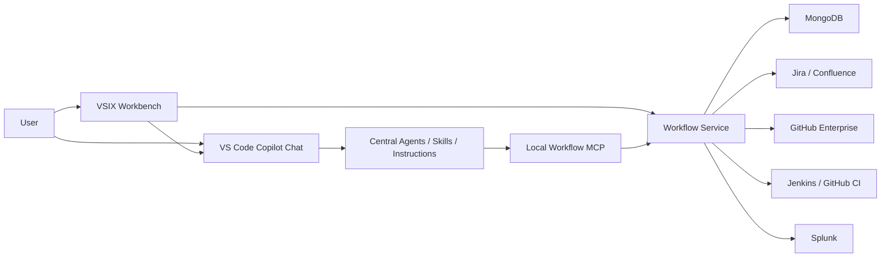
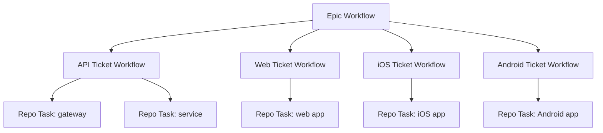
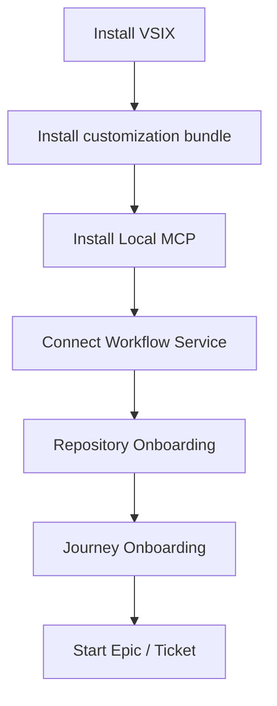
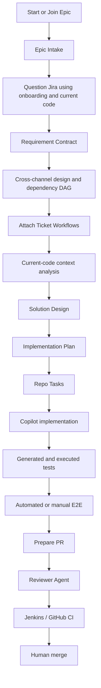
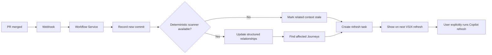

# Local Copilot SDLC Platform — Seven-Repository Design

**Status:** Approved design baseline  
**Approved:** 2026-08-16  
**Visibility:** All seven upstream repositories are public  
**Audience:** Developers, Architects, QA, Scrum Masters, Product Owners, Platform Engineering, and the internal implementation agent  
**Supersedes for repository topology:** the monorepo topology in the v2 design  

## 1. Outcome

Build a human-controlled SDLC workbench whose only AI reasoning runs in an interactive VS Code GitHub Copilot Chat session. The platform covers Epic discovery, weak-Jira requirement analysis, cross-repository design, implementation, generated tests, manual E2E, accessibility, analytics tagging, PR preparation, review, CI evidence, release readiness, repository onboarding, and hybrid Journey onboarding.

The current monorepo proves a narrow Ticket vertical slice. It is not the completed platform. The approved target separates runtime components, reusable Copilot behavior, shared contracts, and reference verification into seven public repositories.

The machine-readable accountability list is `docs/architecture/seven-repository-output-inventory.yaml`. Every implementation-plan task and final verification result must reference one or more IDs from that inventory.

## 2. Non-negotiable boundaries

1. VS Code GitHub Copilot Chat on the user's workstation is the only AI runtime.
2. Workflow Service, Local MCP, VSIX, GitHub Actions, Jenkins, MongoDB, and integrations never call a model.
3. VSIX does not depend on the VS Code Language Model API in MVP.
4. VSIX can create deterministic records, show results, prepare commands, and open Copilot Chat; it cannot submit or resume Copilot work unattended.
5. Local Workflow MCP runs over stdio and cannot receive Webhooks.
6. Workflow Service is the authoritative workflow and audit store. Jira receives concise projections for wider visibility.
7. Company MongoDB stores MVP workflow state and structured artifacts. GridFS, S3, and LLM Wiki are not MVP dependencies.
8. No public deliverable depends on Docker, Compose, a local database, MinIO, Testcontainers, or a cloud Agent.
9. All upstream repositories are public and contain only fictional data, example domains, mock adapters, and redacted templates.
10. Company employees, Pod membership, real Journey graphs, internal endpoints, credentials, repository names, payloads, and business artifacts never enter the public repositories.
11. MVP identity is audit-only. Authorization and role enforcement wait for corporate SSO and directory discovery.
12. Account Opening alone defaults to Web/API-first, Native-later compatibility. Every other Journey must declare its own release and channel-transition policy.

## 3. Approved repositories

| Repository | Responsibility | Explicitly excluded |
|---|---|---|
| `sdlc-agent-platform` | Architecture portal, ADRs, cross-repository roadmap, platform BOM, handoff, release and verification index | Runtime implementation and Copilot customizations |
| `sdlc-workflow-contracts` | OpenAPI, JSON Schemas, events, generated Java/TypeScript contracts, compatibility fixtures | Workflow decisions and UI |
| `sdlc-workflow-service` | Spring Boot workflow state, MongoDB, policy execution, audit, projections, enterprise adapters, Splunk logs | AI reasoning and local workspace access |
| `sdlc-workflow-mcp` | Local stdio MCP, bounded Copilot tools, Service client, Outbox, local diagnostics | Server Webhooks, direct Mongo access, AI reasoning |
| `sdlc-copilot-customizations` | Agents, Skills, Instructions, Prompts, Hooks, MCP profiles, Policies, Templates, Evals, routing and bundles | Runtime tasks, company employee/Journey data |
| `sdlc-vscode-workbench` | VSIX HTML/Webview UI, nine views, refresh, bundle/MCP onboarding, diagnostics | Model invocation and canonical state |
| `sdlc-reference-demo` | Fictional cross-channel Journey, mocks, browser E2E, contract smoke tests, manual QA examples | Production Scrum Board and company integrations |

The platform does not use Git submodules. Each component releases independently, and `sdlc-agent-platform/platform-bom.yaml` identifies a verified combination.

## 4. Runtime architecture

### 4.1 Model boundary

| Component | May reason with an LLM? | Role |
|---|---:|---|
| Copilot Chat | Yes, interactively | Analyze, design, implement, generate tests, review, summarize |
| Copilot customizations | No runtime of their own | Shape Copilot behavior and structured outputs |
| Local MCP | No | Read bounded context and persist structured results |
| Workflow Service | No | State, policy, audit, integrations, projections |
| VSIX | No | UI, commands, status and diagnostics |
| GitHub Actions/Jenkins | No | Compile, test, lint, package and report CI |

### 4.2 Button behavior

A VSIX action may create a deterministic workflow record, construct an exact command, open Copilot Chat, wait for a result saved through MCP, and refresh the view. It must never claim that an Agent ran merely because a button was clicked.

## 5. Workflow hierarchy

- **Epic Workflow** owns the shared business goal, Journey scope, Requirement Contract, cross-channel design, API Contract, dependency DAG, compatibility, Feature Flags, Native train, aggregate risk, and overall E2E.
- **Ticket Workflow** owns one delivery unit's stages, artifacts, owner, approvals, risks, and Jira projection.
- **Repo Task** owns the changes for one repository: base commit, branch, plan, tests, PR, review, CI, and merge commit.
- **Developer View** is a role-oriented overview.
- **My Work** is the authenticated person's assignment queue.
- **Ticket View** is a delivery aggregate.
- **Repo Task View** is a code-level drill-down and is not a duplicate Ticket view.

An Epic can start from a Jira Epic, several Jira tickets, a manually entered emergency change, or a Jira Epic plus an unrecorded change. Manual changes record actor, time, reason, affected scope, communication status, and the Jira backfill requirement.

## 6. Initialization versus delivery

### 6.1 First-time platform and repository initialization

Repository Onboarding records stack, modules, entry points, APIs, HTTP clients, data/message dependencies, tests, build/CI/release, conventions, risks, evidence files, and source commit. It produces `.sdlc/repository.yaml`, a human-readable HTML report, and an optional knowledge graph.

Journey Onboarding records Web/iOS/Android/WebView screens, UI actions, Figma references, client symbols, HTTP methods and paths, payload provenance, response fields, state/error/recovery behavior, authentication transfer, Feature Flags, minimum app version, channel transitions, repository evidence, and known gaps.

Journey input need not initially list every repository. Each channel is classified as `REPOSITORY_VERIFIED`, `AUTHORITATIVE_DOC_ONLY`, `NOT_APPLICABLE`, `KNOWN_GAP`, or `UNRESOLVED`. Overall readiness is `MISSING`, `PARTIAL`, `SUFFICIENT`, `VERIFIED`, or `STALE`.

### 6.2 Daily requirement delivery

The workflow begins with requirements, not a PR. Requirement analysis combines Jira intent, Journey Onboarding, Repository Onboarding, targeted analysis of current code/tests, Confluence/Figma evidence, and explicit human decisions. Onboarding accelerates navigation but never replaces current-code verification.

### 6.3 Post-merge incremental maintenance

No post-merge server process wakes Copilot. When deterministic scanning is unavailable, the safe degradation is to mark evidence stale and wait for a user-started refresh.

## 7. Evidence and long context

Evidence precedence is:

1. current Jira/Epic/manual change intent;
2. Journey Onboarding;
3. Repository Onboarding;
4. current code and tests at a pinned commit;
5. Confluence/Figma and historical design;
6. explicitly labelled Agent inference.

Evidence classes are `TEST_VERIFIED`, `CODE_VERIFIED`, `DOC_STATED`, `HUMAN_CONFIRMED`, `AI_INFERRED`, and `UNRESOLVED`. Code/onboarding conflict makes the onboarding artifact stale. Business behavior without evidence becomes a question, not a fabricated rule.

After restart, VSIX queries Mongo-backed state, shows the last completed stage and next action, and prepares `/resume-workflow <workflow-id>`. MCP builds a bounded context pack containing the goal, approved artifact summaries, unresolved questions, relevant Journey subgraph, pinned repositories, applicable policies, and next-stage contract. Full chat history and entire repositories are not treated as durable memory.

If MCP is temporarily unavailable, a schema-valid local Outbox artifact may be created and must be explicitly synchronized later. The UI never silently presents an unsynchronized local file as server state.

## 8. Account Opening compatibility profile

Only Account Opening defaults to:

- Web and API deploy continuously or together;
- Native ships on a common release train;
- API behavior remains compatible with installed older Native versions;
- required platform/app-version headers have safe legacy fallback behavior;
- AWS-hosted toggle capability controls Native exposure;
- APIs follow Expand -> Migrate -> Contract;
- every flag has an owner, default, cohort/version conditions, kill switch, metric, expiry, and removal condition.

Removing/renaming fields, adding required fields, changing type/nullability/semantics, expanding enums consumed strictly by Native, changing status/error/auth/pagination/idempotency behavior, or rejecting old valid payloads are potentially breaking. An OpenAPI diff is necessary but not sufficient.

Every other Journey asks the user to define channel transitions, release order, compatibility window, and flag provider.

## 9. Stage skip and human control

Users may skip running the Design Agent or repeat discussions, but they cannot silently erase design responsibility. A `SkipAttestation` records workflow, stage, actor, timestamp, reason, decision summary, prior participants, evidence references, unresolved risks, policy result, and expiry where applicable.

Skipping an AI design conversation does not skip API compatibility, security, required tests, CI, or human PR merge. High-risk cross-repository, API contract, data, security, Native/Web interface, release-order, and accessibility changes require a named approval record. MVP warns and audits without enforcing corporate roles.

## 10. Shared contracts repository

### 10.1 Required domain types

`Principal`, `DirectoryPerson`, `Pod`, `PodMembership`, `EpicWorkflow`, `TicketWorkflow`, `RepoTask`, `Journey`, `JourneyComponent`, `Repository`, `RepositorySnapshot`, `WorkflowStage`, `Task`, `Artifact`, `Decision`, `Approval`, `SkipAttestation`, `Assignment`, `Dependency`, `ChangeRequest`, `ApiContract`, `FeatureFlagPlan`, `NativeReleaseTrain`, `JiraProjection`, `FreshnessStatus`, `McpInstallation`, `DiagnosticResult`, and `AuditEvent`.

`DirectoryPerson` can be imported and assigned before a person installs VSIX. `Principal` is created or linked when that person authenticates, so task assignment does not depend on onboarding the client.

### 10.2 Artifact types

- Epic Intake and Manual Emergency Change
- Requirement Contract and Requirements Interview
- Current Code Context Evidence
- Repository and Journey Onboarding
- HTTP Call Graph and impact analysis
- API Compatibility Assessment
- Cross-platform and Solution Design
- Implementation Plan
- Generated Test Plan and automated result
- Manual E2E plan/result
- Accessibility and Analytics Tagging assessments
- PR Preparation and PR Review
- Epic Risk, Blocker, Stand-up, Release Readiness and Jira Update
- Internal Handoff and Completion Report

### 10.3 Events and release outputs

Events cover Epic/Ticket/Repo Task changes; stage start/completion/skip; artifact publication/supersession; approval; assignment; blockers; graph freshness; Jira projection; CI; manual E2E; and release readiness.

The repository publishes OpenAPI, JSON Schemas, Java DTO/client artifacts, TypeScript types/client artifacts, compatibility fixtures, contract tests, examples, and a `contracts.lock.json` format.

## 11. Workflow Service repository

The Java Spring Boot service owns Epic, Ticket, Repo Task, onboarding, artifact/version, Stage Gate, skip, approval/decision, dependency DAG, assignment, audit, freshness, Scrum reporting, Jira projection, and integration status modules.

MongoDB stores workflow instances, tasks, artifacts, decisions, approvals, audit events, directory/Pod data, Journey/repository graphs, projection state, and diagnostic summaries. Normal artifacts are documents; large reports use ordered chunks. Jira is never canonical storage. GridFS and S3 remain future providers.

MVP authentication paths are GitHub Enterprise plus administrator employee binding for developers, and administrator-pre-enrolled `DirectoryPerson` plus one-time enrollment for non-GitHub users such as some Scrum Masters. Authorization remains `AUDIT_ONLY` until company SSO/RBAC integration.

Adapters cover Jira, GitHub Enterprise, Jenkins status, Confluence references, and Splunk output. Public code supplies interfaces, mocks, error semantics, and example configuration; the internal agent supplies real authentication and endpoint behavior.

Freshness states are `LIVE`, `DELAYED`, `STALE`, and `OFFLINE`, supported by `generatedAt`, `sourceRevision`, `sourceUpdatedAt`, `expiresAt`, `lastCheckedAt`, and `correlationId`.

Service logs are structured JSON suitable for Splunk and include correlation/workflow/entity IDs, action, duration, outcome/error, retry state, and safe identity. Tokens, code, payloads, and artifact bodies are excluded.

## 12. Local MCP repository

The stdio MCP exposes bounded workflow tools:

- `start_epic`, `join_epic`, `change_epic`
- `start_ticket`, `resume_workflow`, `create_repo_task`
- `get_work_context`, `get_related_artifacts`, `publish_artifact`
- `complete_stage`, `skip_stage`, `submit_decision`, `submit_approval`
- `assign_work`, `report_blocker`
- `record_manual_e2e`, `record_accessibility_result`, `record_tagging_result`
- `prepare_jira_projection`, `get_freshness`, `get_diagnostics`

Onboarding/context tools are:

- `onboard_repository`, `onboard_journey`, `sync_onboarding_artifact`
- `scan_repository_context`, `analyze_http_dependencies`
- `get_repository_graph`, `get_journey_graph`, `mark_context_stale`

Code-context providers are pluggable: Understand Anything, an available deterministic scanner, Copilot-only targeted analysis, or manual structured import. The MCP never accesses MongoDB directly.

The supported Local MCP catalog includes Workflow (required); Jira, Confluence and GitHub Enterprise (recommended); Code Context/Understand Anything, Figma and Jenkins (optional); and Teambook, LLM Wiki and Splunk diagnostics (future). VSIX MCP Center provides provenance, installation and health guidance.

Local logging uses redacted rolling files and correlation IDs. Tool bodies are represented by schema, byte size, and hash rather than sensitive content.

## 13. Copilot customizations repository

### 13.1 Agents

The required thirteen Agents are:

1. Epic Delivery Analyst
2. Delivery Coordinator
3. Requirement Analyst
4. Code Context Analyst
5. Solution Architect
6. Planner
7. Java Implementer
8. Web Implementer
9. iOS Implementer
10. Android Implementer
11. Test Designer
12. Accessibility QA
13. PR Reviewer

The Reviewer has a dedicated model preference/fallback policy when enterprise Copilot permits model selection. Otherwise its isolation is provided by review-specific instructions and a read-only tool profile.

### 13.2 Skills

Required workflow Skills are `start-epic`, `join-epic`, `change-epic`, `start-ticket`, `resume-workflow`, `analyze-code-context`, `grill-requirement`, `design-solution`, `plan-change`, `implement-task`, `generate-tests`, `prepare-pr`, and `review-pr`.

Required onboarding Skills are `onboard-repository`, `onboard-journey`, `sync-onboarding`, `analyze-http-call-graph`, and `import-pod-members`.

Required QA Skills are `plan-manual-e2e`, `record-manual-e2e`, `review-accessibility`, `review-analytics-tagging`, and `assess-api-compatibility`.

Required Scrum Master Skills are `analyze-epic-risk`, `prepare-standup`, `find-blockers`, `check-release-readiness`, and `draft-jira-update`.

`grill-requirement` uses Socratic questioning and code evidence but cannot invent BA decisions. `import-pod-members` requires dry run, masked preview, explicit confirmation, idempotent apply, and an Import Report.

### 13.3 Instructions, policies and assets

Instructions cover global evidence, Java Spring Boot, Reactor/WebFlux, Web, iOS, Android, Hybrid Journey, API compatibility, Native release/flags, architecture/design, automated tests, manual E2E, accessibility, analytics tagging, security/privacy, observability, documentation/onboarding, Jira traceability, and PR review.

Policies cover stage gates/skips, backward compatibility, Native compatibility, Feature Flags, artifact evidence/freshness, privacy/redaction, manual E2E, accessibility, tagging, Jira projection, Pod assignment, reviewer routing, and public fixture safety.

Templates cover every Artifact in section 10.2. Evals include happy paths, weak input, cross-repository, breaking change, Native delay, emergency change, skipped design, stale context, sensitive data, unavailable MCP, schema conformance, and non-fabrication.

Hooks are deterministic lifecycle declarations: `before-stage`, `after-stage`, `artifact-published`, `stage-skipped`, `workflow-resumed`, `context-stale`, `pr-created`, and `ci-updated`. They do not create background AI work.

The release bundle contains `agents/`, `skills/`, `instructions/`, `prompts/`, `hooks/`, `mcp/`, `policies/`, `schemas/`, `templates/`, `evals/`, `onboarding/`, `routing/`, `manifests/`, and `versions/`, plus version, hash, compatibility and rollback metadata.

## 14. VSIX repository

The extension provides nine distinct views:

1. Developer View
2. Scrum Master View
3. My Work
4. Epic View
5. Ticket View
6. Repo Task View
7. Customization Center
8. MCP Center
9. Diagnostics

The views must use separate view models and entity semantics rather than one generic task tree with different titles. Formal reports render as accessible HTML/Webviews, guided by the UI/UX Pro Max design system. Status is never color-only.

Data refresh occurs when a view opens, when the VS Code window regains focus, on a configurable 30–60 second poll, and by manual refresh. ETags/versions avoid unnecessary reads. Every card shows observation time and `LIVE`, `DELAYED`, `STALE`, or `OFFLINE`.

Scrum Master actions—Epic risk, stand-up, blockers, release readiness and Jira update—prepare a Delivery Coordinator invocation. The resulting artifact appears only after Copilot saves it through MCP.

VSIX logs to an Output Channel and redacted rolling local file. Diagnostics can export a redacted support bundle containing versions, health, correlation IDs and configuration shape, but no source, artifact body, payload or credentials.

## 15. Reference demo repository

The demo proves the contracts without becoming a production board. It includes a fictional Account Opening hybrid Journey; API, Web, iOS and Android records; screen-to-API/payload mappings; Native-later release; flags; compatibility rejection; skip audit; Scrum views; automated and manual E2E; accessibility; analytics tagging; MCP failure; and Service offline behavior.

Browser E2E and contract smoke tests validate Epic -> Ticket -> Repo Task -> implementation evidence -> PR/review -> CI. No test depends on Docker or a company service.

## 16. Jira projection and Scrum Master visibility

Workflow Service remains the source of truth. After an important artifact is saved, it creates a safe summary and an idempotent projection request. Jira comments contain stage, conclusion, risk/blocker, next step, artifact reference, time, and actor—never the full report, code, sensitive payload, or directory.

Scrum Master AI reports are snapshots. If underlying workflow versions change, VSIX marks them stale. People without VSIX continue to receive Jira milestone visibility.

## 17. Public/private data separation

The public repositories contain only schemas, fictional examples, adapters, tools, and documentation. Real Pod rosters are imported from local CSV/JSON through the approved Skill and stored in company MongoDB. Per-repository internal context is proposed through `.sdlc/repository.yaml` and local onboarding documents. Cross-repository Journey data is stored in Workflow Service and can later be exported to an optional company-private Journey repository.

No eighth public product repository is required for company configuration. The internal deployment may create a private tenant/config repository when company governance is known.

## 18. Versioning and releases

Every repository uses SemVer. Contracts publish independently; Java and TypeScript consumers pin an explicit version and retain `contracts.lock.json`. The customization bundle declares compatible Workflow API, contract, MCP, VS Code/Copilot, and VSIX ranges. VSIX performs a compatibility handshake and blocks unsafe writes while preserving safe reads.

Public release artifacts are:

- Workflow Service executable JAR and example YAML;
- Local MCP npm/tarball distribution;
- VSIX package;
- customization ZIP with checksum;
- Maven/npm/JSON Schema contract bundles;
- reference demo static build and test reports;
- platform HTML report and BOM.

GitHub Actions may compile, test, lint, validate contracts, run E2E, package, create checksums/SBOMs, and publish releases. It does not call a model. Internal dependency transport—GHES Packages, Nexus, Artifactory, or mirrored release bundles—is selected by the internal agent.

## 19. Migration from the current monorepo

1. **M0 — Freeze and inventory:** tag the baseline; map every file to keep, move, rewrite, or retire; delete nothing.
2. **M1 — Contracts:** extract existing schemas/types/DTOs; add Epic, Ticket, Repo Task, events and missing artifacts; remove duplicates.
3. **M2 — Workflow Service:** move Java and tests; retain the current Ticket slice; then add Epic, Repo Task, freshness, Scrum and Jira projection.
4. **M3 — Local MCP:** move current tools; consume released contracts; add the full catalog, Outbox, diagnostics and redaction.
5. **M4 — Customizations:** move the existing three Agents and four Skills; add all approved Agents, Skills, Instructions, Policies, Templates, Hooks, Evals and bundle release metadata.
6. **M5 — VSIX:** move the extension; replace generic trees with nine view models; add onboarding, freshness, resume and diagnostics.
7. **M6 — Reference Demo:** move Web UI and Playwright; use only fictional cross-channel data; cover the entire workflow.
8. **M7 — Platform cleanup:** after destination verification, remove migrated runtime code from the original repository and retain architecture, BOM, reports and handoff.

Migration follows copy -> verify -> switch -> clean. Existing implementation is not destructively removed before destination repositories pass their acceptance checks.

## 20. Definition of Done

### Platform

- Seven repository links, ownership, roadmap and platform BOM exist.
- Markdown and human-readable HTML architecture reports are current.
- Every design promise maps to a repository, file, test and status.
- Public/internal handoff and redacted internal report templates are complete.

### Contracts

- OpenAPI/JSON Schemas validate and generated Java/TypeScript outputs compile.
- Epic/Ticket/Repo Task, all artifacts, events and compatibility cases are covered.
- Breaking contract changes are detected.

### Workflow Service

- Complete workflow/state/audit/freshness/assignment/projection behavior exists.
- MongoDB is configurable without a local or container dependency.
- Public adapter contract tests pass.
- Structured logs are suitable for Splunk.
- No model client exists.

### Local MCP

- stdio startup and tool discovery pass.
- Every tool has strict input/output schema, bounds, safe error semantics and correlation.
- Save/resume, redaction, retry, cancellation, diagnostics and Outbox work.

### Customizations

- All thirteen Agents and all approved Skills exist.
- Core Skills have positive, negative, degraded and non-fabrication Evals.
- Java/Web/iOS/Android, hybrid Journey, compatibility, QA and Scrum paths are covered.
- Bundle install, verification and rollback metadata are valid.

### VSIX

- Nine views have distinct models and actions.
- Accessible HTML reports, timestamps, freshness and offline behavior work.
- Resume, customization install, MCP onboarding and diagnostics work.
- No model API is invoked.

### Reference Demo

- Fictional Epic -> Tickets -> Repo Tasks -> PR/review/CI completes.
- API/Web/iOS/Android, Native delay, flag, compatibility, manual E2E, accessibility and tagging are demonstrated.
- Browser E2E and contract smoke tests pass without Docker.

## 21. Deferred extensions

- LLM Wiki and generated team wiki
- S3 Artifact provider
- Teambook synchronization
- corporate SSO and enforced RBAC
- server-side MCP where company deployment permits it
- real-time SSE/WebSocket UI updates
- background/cloud Agents
- richer deterministic graph aggregation
- full knowledge graph governance and ACL-aware retrieval

## 22. Current baseline gap audit

The current PR contains three Agents—Requirement Analyst, Solution Architect, and PR Reviewer—against the required thirteen. It contains `start-ticket`, `resume-workflow`, `prepare-pr`, and `importing-pod-members` Skills, but not the approved Epic, code-context, design, implementation, QA, onboarding, compatibility, and Scrum Master catalog.

The current Workflow Service implements a useful Ticket vertical slice, identity/Pod examples, Mongo-shaped ports, mock enterprise adapters, and a Journey analyzer. It does not yet implement the complete Epic/Ticket/Repo Task hierarchy, Epic revision/staleness propagation, full Jira projection lifecycle, Scrum artifacts, complete assignment/routing, production authentication, or all artifact types.

The current VSIX declares nine views but largely reuses a generic task tree. The current MCP exposes twelve slice-oriented tools rather than the approved workflow and onboarding catalog. Shared contracts are embedded in the monorepo and lack independent release ownership. The Web UI and E2E are reference-demo material rather than a production runtime component.

Accordingly, these areas are `PARTIAL`; passing tests prove the implemented slice and do not prove completion of the target platform.

## 23. Internal handoff evidence

The internal agent must return a redacted report rather than code. It covers environment facts, GHES/Jira/Confluence/Jenkins/Mongo/Splunk connectivity, company policy deviations, bundle discovery, real repository/Journey pilot coverage, screenshots where allowed, test commands and outcomes, latency bands, security/accessibility review, failures, workarounds, and unresolved decisions. Public review uses that report because internal code cannot be uploaded.
